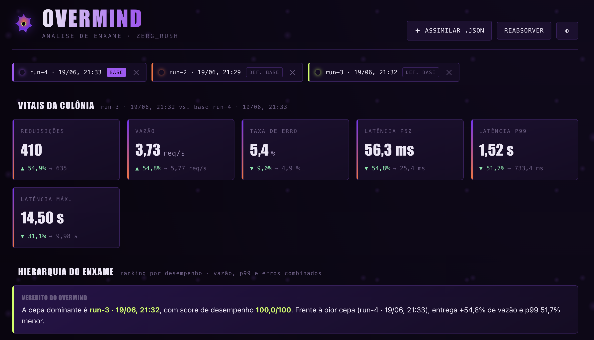
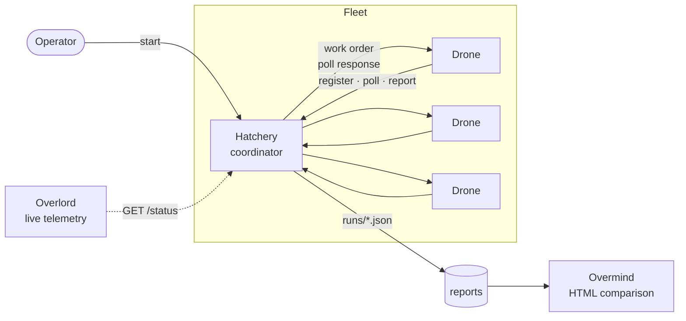

<p align="center">
  
</p>

<p align="center">
  
</p>

<p align="center">
  
  
  
  
  
</p>

# zerg

An HTTP load tester that attacks a target with a **swarm** of concurrent requests and reports latency and errors. It runs standalone on one machine or **distributed** across a fleet of workers — and leans, unapologetically, on the Zerg metaphor: you spawn a colony, it attacks, and the coordinator consolidates the damage.

> Fleet too small for the requested load? The answer is canonical: **`Spawn more Overlords.`**

- **`zerg`** — the library (the swarm logic).
- **`zerg_attack`** — the binary/CLI (the `local`, `hatchery`, `drone`, `start`, `overlord` modes).

## The metaphor

| Zerg unit | In `zerg` |
|---|---|
| **Swarm** | the load test itself — thousands of concurrent requests |
| **Drone** | a *worker*: runs the slice of load it was given and reports results |
| **Hatchery** | the *coordinator*: validates the request, splits the load, consolidates reports |
| **Overlord** | the *live dashboard* in the terminal: totals, instantaneous req/s, fleet errors |
| **Overmind** | the HTML tool for **comparing** runs (`overmind-compare.html`) |
| **Capacity probe** | each Drone measures CPU, memory, and the socket limit (`ulimit -n`) it can sustain |

## Architecture

**Pull** model: Drones only ever *call* the Hatchery (register, ask for work, report). Nothing needs to reach the Drone — NAT/firewall friendly. A work order is never pushed; it is returned to a Drone as the response to its poll.



Only the Hatchery needs an inbound, reachable address: its bind port (default `7700`) must be reachable by every Drone and by any Overlord. Drones and Overlords need only outbound access to it.

## Requirements

- A Rust toolchain new enough for the **2024 edition** / `let`-chains. The code as written builds on **Rust 1.88+**; adjust if you pin a different MSRV.
- A target to attack (anything that speaks HTTP/1.1 or HTTP/2; TLS via `rustls`).
- On the workers, a sensibly high open-file limit (`ulimit -n`) — the Drone probes it to advertise its capacity.

## Installation

```bash
git clone <repo> zerg && cd zerg
cargo build --release
# main binary at target/release/zerg_attack
```
> https://github.com/reu/zerg

The repo also ships helper binaries (`har-sanitize`) and a static HTML tool
(`overmind-compare.html`). Build all binaries with `cargo build --release`, or
run a specific one with `cargo run --release --bin <name>`. (Confirm the exact
bin names against `Cargo.toml`.)

## Usage

All commands and their flags are discoverable with `--help`:

```bash
zerg_attack --help
zerg_attack <command> --help    # e.g. zerg_attack local --help
```

### Options reference

Load parameters are shared by `local` and `start`:

| Flag | Default | Description |
|---|---|---|
| `-u, --url` | *(built-in placeholder — always set your own)* | Target URL. |
| `-d, --duration` | `10s` | Run length (humantime: `30s`, `1m30s`, `2h`). |
| `-c, --concurrency` | `400` | Concurrent in-flight requests (total, across the fleet for `start`). |
| `-t, --threads` | `4` | Worker threads. |
| `--timeout` | `15s` | Per-request timeout. |
| `--har <PATH>` | — | Drive the run from a captured HAR. |
| `--token <TOKEN>` | — | Bearer token; `Bearer ` is prefixed automatically if absent. |
| `--json` | off | *(local only)* write `results.json` instead of a table. |

Topology flags:

| Command | Flag | Default | Description |
|---|---|---|---|
| `hatchery` | `-b, --bind` | `0.0.0.0:7700` | Address/port to listen on. |
| `drone` | `-H, --hatchery <URL>` | *required* | Hatchery base URL to register with. |
| `drone` | `-n, --name <NAME>` | auto (`drone-NN`) | Preferred drone name. |
| `drone` | `--max-concurrency <N>` | socket limit | Cap advertised concurrency. |
| `drone` | `--once` | off | Exit after one work order. |
| `start` / `drone` / `overlord` | `-H, --hatchery <URL>` | *required* | Hatchery base URL. |
| `overlord` | `-i, --interval` | `1s` | Dashboard refresh interval. |

### Local mode (single machine)

Attack a target directly, no fleet:

```bash
zerg_attack local \
  --url https://example.com \
  --duration 30s \
  --concurrency 400 \
  --threads 4 \
  --timeout 15s
```

To replay real traffic, feed it a captured **HAR** and inject a fresh token:

```bash
zerg_attack local --url https://api.example.com \
  --har capture.har --token "$TOKEN" --json
```

Each HAR endpoint becomes its own swarm, running in parallel, with **per-endpoint** telemetry and reporting.

### Distributed mode (fleet)

```bash
# 1) on the coordinator machine — bring up the Hatchery
zerg_attack hatchery --bind 0.0.0.0:7700

# 2) on each worker — register a Drone with the fleet
zerg_attack drone -H http://COORD:7700 --name drone-01
zerg_attack drone -H http://COORD:7700 --name drone-02

# 3) from anywhere — open the live dashboard
zerg_attack overlord -H http://COORD:7700

# 4) launch the attack (the total load is split across the fleet)
zerg_attack start -H http://COORD:7700 \
  --url https://api.example.com \
  --concurrency 1200 --threads 8 --duration 60s \
  --har capture.har --token "$TOKEN"
```

The Hatchery validates the requested concurrency against the fleet's **combined capacity** (based on each Drone's socket limit, with a safety margin). If it doesn't fit:

```
Rejected: Spawn more Overlords.
```

> **Troubleshooting that message:** capacity comes from **Drones** (their socket
> limits), so the real fix is to register more Drones — or lower `--concurrency`,
> or raise `ulimit -n` on the workers. (The line is a StarCraft supply joke;
> the actual lever is more Drones.)

When it finishes, the consolidated report is printed in the Hatchery's terminal and saved to `runs/run-<timestamp>-<run_id>.json`, already including `run_params`, the fleet `timeline`, and the per-endpoint `endpoint_timeline`.

## Overmind — run comparison

<p align="center">
  
</p>

`overmind-compare.html` is a single-page dashboard (no build step, no server, no external dependencies) for comparing several runs. Each loaded run becomes a **strain** (*cepa*) of the swarm; load two or more to see how performance evolved between them.

> Privacy: the files are parsed **locally in your browser** — nothing is uploaded anywhere.
> The interface labels are in Portuguese (e.g. **Assimilar .json** = import, **Reabsorver** = clear all, **def. base** = set as baseline).

### Importing the run reports

1. **Produce the JSON.** Distributed runs are written automatically by the Hatchery to `runs/run-<timestamp>-<run_id>.json` (these already carry `run_params`, `timeline`, and `endpoint_timeline`). For a single-machine run, `zerg_attack local --json` writes a `results.json` you can load the same way.
2. **Open the dashboard.** Double-click `overmind-compare.html` (or open it from the browser). No server needed — it runs entirely client-side.
3. **Import the files.** Click **Assimilar .json** and pick one or more reports, **or** drag-and-drop the `run-*.json` files straight onto the drop zone. Each file is validated (it must contain `total` and `endpoints`) and added as a strain chip.
4. **Compare ≥ 2 runs.** The first file you load becomes the **baseline** (`base`); every delta and the per-endpoint winner is measured against it. Reassign the baseline anytime with **def. base** on any strain chip, or drop a strain with **✕**. Use **Reabsorver** to clear everything.
5. **(Optional) Set concurrency for the load chart.** The *Carga vs. Resposta* chart needs each strain's concurrency. It's filled automatically from `run_params.concurrency`; if a report lacks it, type it into the per-strain field (it switches from `auto` to `manual`).

### What it shows

- **Vitals** (KPIs) vs. baseline: throughput, p99, error rate, p50/p99/max latency.
- **Ranking** of the strains — a 0–100 score weighting **throughput (40%) + inverted p99 (35%) + inverted error rate (25%)**, normalized across the loaded runs.
- **p99 per endpoint** (switchable to p50 or throughput), with a search box and *All / errors-only / slowest* scopes.
- **Load vs. response**: concurrency × latency (p50/p95/p99), plus a "load resistance" top 3.
- **Fleet timeline** and **per-endpoint timeline** (count or response time), with an **"All endpoints"** grid of small multiples. These require the `timeline` / `endpoint_timeline` arrays in the report.
- **Mutation per endpoint**: requests, p99, and errors vs. baseline, with **♛** marking the winning strain (fewest errors, then lowest p99).

## HAR hygiene

Before replaying a HAR, scrub secrets with the `har_sanitize` utility:

```bash
# keep only API endpoints, drop login/logout that rotate the session
har_sanitize capture.har --keep /api --redact -o clean.har
```
> https://github.com/andrematteo/har_sanitizer

It supports `--keep`/`--remove` (filter by URL), `--redact` (masks cookies, `Authorization`, `x-api-key`, query tokens, and sensitive keys in the JSON body), `--strip-cookies`, and `--strip-auth`. The library itself also drops captured `cookie`/`authorization` headers when building requests, so only the token injected at runtime applies.

## As a library

```rust
use std::time::Duration;

let result = zerg::swarm("https://example.com")
    .concurrency(200)
    .threads(4)
    .duration(Duration::from_secs(30))
    .zerg()?;

println!("{result}");
```

Customize the request and the success criterion with `.request(..)` and `.expecting(..)`; build bodies with `empty()`, `full(..)`, or the `json!` macro.

## Report (JSON)

Each run produces, per endpoint and in the aggregated `total`:

```jsonc
{
  "endpoints": {
    "GET /api/users": {
      "requests": { "success": 540, "total": 566, "errors": 26 },
      "reqs_per_second": 56.6,
      "latency_ms": { "avg": 120.3, "p50": 90.1, "p99": 842.0, "min": 12.0, "max": 1500.0 },
      "errors": { "http": { "500": 26 }, "tcp": {} }
    }
  },
  "total": { "...": "..." },
  "run_params": { "concurrency": 1200, "threads": 8, "duration_secs": 60.0, "drones": 3 },
  "timeline": [ { "t_secs": 1.0, "success": 40, "http_error": 0, "tcp_error": 0 } ],
  "endpoint_timeline": {
    "GET /api/users": [ { "t_secs": 1.0, "count": 40, "errors": 0, "avg_ms": 118.2 } ]
  }
}
```

Percentiles use a *t-digest* (computed on demand); counts and errors are exact.

This is exactly the file you feed to **Overmind** (see [above](#overmind--run-comparison)): `total` and `endpoints` are required, while `run_params`, `timeline`, and `endpoint_timeline` unlock the load chart and the timeline views.

## Tests

```bash
cargo test
```

Covers the pure logic (offline, no HTTP target): `BenchmarkResult` aggregation, counts and percentiles, the live `Progress`/`ProgressMap` counters, HAR parsing/retargeting and forbidden headers, error classification, `swarm` validation, and URI `with_path`.
